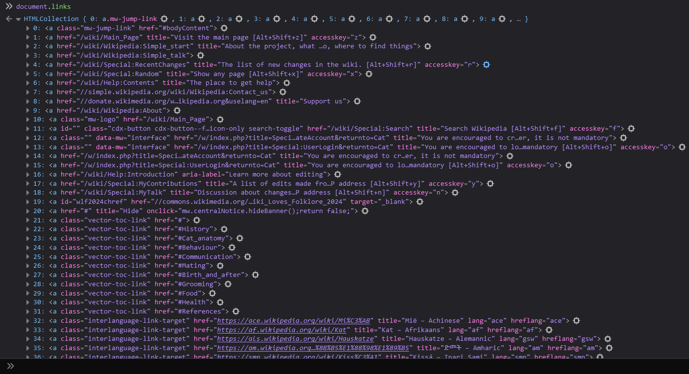

# DOM Manipulation in JavaScript

---

- The DOM is a document model loaded in the browser and representing the document as a node tree, or DOM tree, where each node represents part of the document (e.g. an element, text string, or comment).
- The DOM is one of the most-used APIs on the Web because it allows code running in a browser to access and interact with every node in the document. 
- Nodes can be created, moved, and changed. 
- Event listeners can be added to nodes and triggered on the occurrence of a given event.

<br>

---

## Window Object

- This is only accessible in browser environments.
- Window object can be accessed from the browser console by using the following 

```javascript
console.log(window)
```
- Response will display the Window Object : 


- It can also be accessed (but with less information) using 

```javascript 
console.log(document)
```
- If you want all the information here also use the console.dir() method: 

```javascript
console.dir(document)
```
- we can select any specific property of the windows object using the following:

```javascript
console.log(document.baseURI)
```
```
"https://simple.wikipedia.org/wiki/Cat" 
```
```javascript
console.log(document.links)
```


- **NOTE** that the documents.links is a HTMLCollection. This is not the same as a array
- **Hence** we cannot directory apply methods like `.filter()`,`.forEach()`, etc.
- But there are some properties which are similar: 

```javascript
console.log(document.links[2])
```
```
|> <a href="/wiki/Wikipedia:Simple_start" title="About the project, what …o, where to find things">
```

<br>

---

## Selecting DOM Elements

- Consider a simple html document as follows: 

```html
<!DOCTYPE html>
<html lang="en">
<head>
    <meta charset="UTF-8">
    <meta name="viewport" content="width=device-width, initial-scale=1.0">
    <title>DOM Learning</title>
</head>
<body>
    <h1>DOM Learning From Chai Aur Code</h1>
    <p>Lorem ipsum dolor sit amet consectetur adipisicing elit.</p>
</body>
</html>
```
- The DOM structure for the above html  would look something like this: 


<br>

- To select DOM elements we have a few selector methods like 
  - `.querySelector()`, 
  - `.querySelectorAll()`, 
  - `.getElementById()`, 
  - `.getElementsByName()`, 
  - `.getElementsByClassName()`, 
  - `.getElementsByTagName()`
- Eg: for the [Cat Page](https://simple.wikipedia.org/wiki/Cat) of Wikipedia
```javascript
>> document.getElementById('firstHeading') 
-> <h1 id="firstHeading" class="firstHeading mw-first-heading">
```


- Using these we can manipulate the DOM elements, like replacing the Text (innerHTML) of a node or adding event listeners
- Eg: 
```javascript
>> document.getElementById('firstHeading').innerHTML 
-> "Cat"
>> document.getElementById('firstHeading').innerHTML = 'Animal with Most Plot Armor' 
-> "Animal with Most Plot Armor"
```

