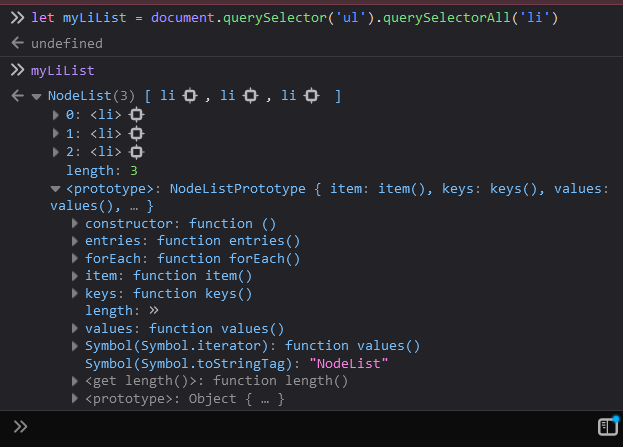

# Document Selectors, NodeCollections & HTMLCollections

---

## Get Element By Id

- Consider the following html code : 
```html
<!DOCTYPE html>
<html lang="en">
<head>
    ...
</head>

<body class="bg-dark">
    <h1 id="heading1" class="Title">DOM Learning From Chai Aur Code</h1>
    <p id="para1">Lorem ipsum dolor sit amet consectetur adipisicing elit.</p>
</body>
</html>
```
- We can fetch the `<h1>` elements by using `document.getElementById()` method.
```js
let myHeading = document.getElementById('heading1');
```
- Once we fetch it, we can get more info about the element:

```js
>> myHeading = document.getElementById('heading1')
-> <h1 id="heading1" class="Title">

>> myHeading
-> <h1 id="heading1" class="Title">

>> myHeading.id
-> "heading1"

myHeading.class
-> undefined

>> myHeading.className
-> "Title" 

>> myHeading.innerHTML
-> "DOM Learning From Chai Aur Code"
```
- **NOTICE** how we get undefined when we try to fetch the class attribute of the tag using `myHeading.class`.
- This is because the document actually stores the class attribute in the `className` property. (This is why when we assign class attribute to the `className` property, when we write React code)

<br>

- Me can also get the specific attribute values by using the .getAttribute() method (which is a function of the `Element` object).
```js
>> myHeading.getAttribute('class')
-> "Title"
```

<br>

- Similar to the getAttribute() method, we can also set the attribute values by using the .setAttribute() method.
```js
myHeading.setAttribute('class', 'testing');
myHeading.setAttribute('id', 'testingID');
```


<br>

---

## Style Properties

- using the style property of the elements we can change the css styling of the elements:

```js
>> myheading = document.getElementById('heading1')
-> <h1 id="heading1" class="Title">

>> myheading.style.backgroundColor = 'limegreen'
"limegreen"

>> myheading.style.fontSize = '50px'
-> "50px"

>> myheading.style.padding = '10px'
-> "10px" 

>> myheading.style.padding = '20px'
-> "20px" 
```
<br>

---

## Changing Content of the elements

- consider the following example:

```js 
>> myHeading.textContent
-> "DOM Learning From Chai Aur Code"

>> myHeading.innerText
-> "DOM Learning From Chai Aur Code"

>> myHeading.innerHTML
-> "DOM Learning From Chai Aur Code"
```
- As we can see that all the 3 functions above seem to do the same thing, but they are actually different.
- `.innerText` fetches us only what is actually visible on the page.
- `.innerContent` fetches what is the actual content of the element (some of it might be hidden).
- `.innerHTML` fetches not only the value but all the html tags within that element.
- Consider that the `<h1>` element of the page was written in the following manner : 

```html
<h1 id="heading1" class="Title">
        DOM Learning From 
        <span style="display: none;">Chai Aur Code</span>
</h1>
```
- Then the commands will not be the same anymore:

```js
>> myHeading.textContent
-> "DOM Learning From "

>> myHeading.innerText
-> "DOM Learning From Chai Aur Code"

>> myHeading.innerHTML
-> DOM Learning From <span style="display: none;">Chai Aur Code</span>
```

<br>

---

## QuerySelectors 

- These are the selectors which are most popular in the DOM.
- There are 2 types of this selector:
    1. `.querySelector('element')` - return only the first occurrence of element matching the 'query'
    2. `.querySelectorAll('element)` - returns an NodeCollection of all the occurrences of elements which match the 'query'

- Consider the following html code : 

```html
<body class="bg-dark">
    <h1 id="heading1" class="Title">
        DOM Learning From <span style="display: none;">Chai Aur Code</span>
    </h1>

    <h2>Sub Heading 1</h2>
    <h2>Sub Heading 2</h2>
    <h2>Sub Heading 3</h2>

    <p id="para1">Lorem ipsum dolor sit amet consectetur adipisicing elit.</p>

    <input type='password'></input>

    <ul>
        <li class='list-item' >one</li>
        <li class='list-item' >two</li>
        <li class='list-item' >three</li>
    </ul>

</body>
```
- In order to select a node of the document: 
  - we can use element tag (eg: 'h1','p',etc)
  - we can use `id` (eg: '#heading1')
  - we can use `class` (eg: '.Title')

- Now let us see how to select elements from the document using the query selector: 

```js
>> document.querySelector('h2');
-> <h2>Sub Heading 1</h2>

>> document.querySelector('#heading1');
-> <h1 id="heading1" class="Title"> DOM Learning From <span style="display: none;">Chai Aur Code</span></h1>

>> document.querySelector('.Title');
-> <h1 id="heading1" class="Title"> DOM Learning From <span style="display: none;">Chai Aur Code</span></h1>

>> document.querySelector('input[type="password"]');
-> <input type='password'></input>

>> document.querySelector('p:first-child');
-> <p id="para1">Lorem ipsum dolor sit amet consectetur adipisicing elit.</p>
```
- Similarly we can grab all the elements using the same css selectors we use to style the elements.
- We can chain the methods also (similar to the forEach, map, filter, etc)

```js
>> myli1 = document.querySelector('ul').querySelector('li')
-> undefined

>> myli1.innerText
-> "one"

>> myli1.style.backgroundColor = 'limegreen'
-> "limegreen"
```
- **Remember** that querySelector will only grab the first node.

<br>

- Now let us see how to select multiple nodes from the document using the `querySelectorAll()`:



- **NOTICE** how the NodeList is not a pure array. It does have a length property and a `.forEach()` function in it's prototype but there is no `map`, `reduce`, `filter`, etc functions. 
- Hence we cannot directly apply these method to the NodeList which is returned from the `.querySelectorAll()` method.
- **Additionally** we cannot manipulate the NodeList elements at once 

```js
>> myLiList.style.backgroundColor = 'limegreen';
-> Error
```
- We will have to select a perticular element of the NodeList and then change it.

```js
>> myLiList[0].style.backgroundColor = 'orange';
-> "limegreen"
>> myLiList[1].style.backgroundColor = 'white';
-> "white"
>> myLiList[2].style.backgroundColor = 'green';
-> "green"
```
- We can use the `.forEach()` method same as an Array with a callback function.

```js
>> myLiList.forEach((element) => {
    element.style.backgroundColor = 'limegreen';
});
-> undefined
```
- The above snippet, changes all the elements of the myLiList elements into `limegreen` background color.

<br>

---

## Get Elements by ClassName

- We can also get a list of elements by using the .`getElementsByClassName()` method.
- **Note** that this method, unlike the `.querySelectorAll()` method, returns a HTMLCollection and not a NodeList.
- HTMLCollections most notably does not have the `.forEach()` method.


- HTMLCollections and NodeList can be converted into simple arrays using teh `Array.from()` method.
- It is a in-built method of the Array Object.


- Now we can use all the functions of arrays like `forEach`,`map`,`filter`,etc

<br>

> Now using the knowledge of these functions, we can use these directly in the script tags of a html or in code of React to do Page manipulations very easily.