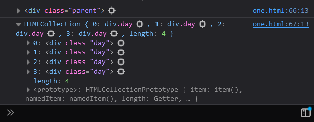
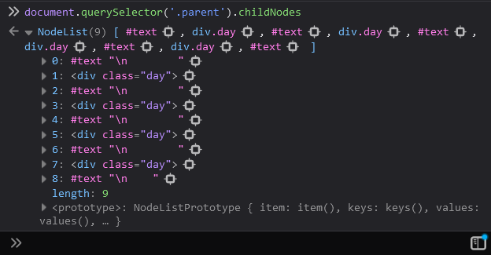

# Adding Elements into the DOM


## `.children` property of a Parent Element

- Consider the following code:

```html
<!DOCTYPE html>
<html lang="en">
<head>
    <meta charset="UTF-8">
    <meta name="viewport" content="width=device-width, initial-scale=1.0">
    <title>DOM Learning</title>

    <style>
        .bg-dark{
            background-color: #212121;
            color: #fff;
        }
    </style>
</head>

<body class="bg-dark">
    
    <div class="parent">
        <div class="day">Monday</div>
        <div class="day">Tuesday</div>
        <div class="day">Wednesday</div>
        <div class="day">Thursday</div>
    </div>

</body>
<script>
    parentElement = document.querySelector('.parent');
    console.log(parentElement);
</script>
</html>
```
- Output:



- `parentElement.children` gives us an HTMLCollection which thought we cannot higher order functions to loop, but we can still use a classic for Loop:

```js
for(let i = 0; i < parentElement.children.length; i++){
    console.log(parentElement.children[i].textContent);
}
```
- Output

```js
Monday
Tuesday
Wednesday
Thursday
```
<br>

---

## `firstElementChild` , `lastElementChild` , `nextElementSibling` , `previousElementSibling` & `.parentElement`

- For a parent element, `firstElementChild` gives us the first child element of that element
- For a parent element, `lastElementChild` gives us the last child element of that element
- Eg:

```js
parentElement = document.querySelector('.parent');
console.log(parentElement.firstElementChild);       // Monday
console.log(parentElement.lastElementChild);        // Thursday
```

<br>

- We can not only get the child element from the parent element but also vise-versa

```js
let child = document.querySelector('.day')
let parent = child.parentElement;
console.log(`Child: ${child} \n Parent: ${parent}`);
```

- We can use the next and previous element's siblings from the `element.nextElementSibling` and `element.previousElementSibling`
- Eg:

```js
let element = document.querySelector('.day');
console.log(element.nextElementSibling);        // Tuesday
console.log(element.previousElementSibling);    // null
```

<br>

---

## `ChildNodes`

- The `.childNodes` property of an element will return an NodeList of all the child nodes within it. 
- They are usually much more than you'd expect as even line breaks and comments and texts are included in the NodeList along with the html elements.
- Eg:

```js
let element = document.querySelector('.parent');
console.log(element.childNodes);
```



- That was all about traversing elements in the DOM. Now we will look at Creating and Removing Elements from the DOM

<br>

---

## Creating Elements into the DOM

- we can create elements using the `.createElement('elementTag')`
- Eg: Consider the Following Code 

```html
<!DOCTYPE html>
<html lang="en">
<head>
    <meta charset="UTF-8">
    <meta name="viewport" content="width=device-width, initial-scale=1.0">
    <title>Chai Aur Code</title>
    <style>
            .bg-dark{
                background-color: #212121;
                color: #fff;
            }
        </style>
</head>
<body class="bg-dark">
    
</body>
<script>
    const mainDiv = document.createElement('div')
    console.log(mainDiv)
    mainDiv.id = Math.round(Math.random()*10 + 1)
    mainDiv.className = "main"
</script>
</html>
```
- The above js script in the html will add an element into the DOM, giving it a random number ID and "main" class attributes. 
- For specialized attributes and custom attributes we formally use the `.setAttribute` method.
- We can also add styling to these added elements.

```html
<script>
    mainDiv.setAttribute('title','generatedTitle')
    mainDiv.setattribute('style', 'background-color: #limegreen; color: #purple;')
</script>
```
- We can add innerText or innerHTML to the created elements using the `.appendChild()` method.
- Eg:

```html
<script>
    let insideText = document.createTextNode("This is a Div Element made from JS")
    mainDiv.appendChild(insideText)
</script>
```
- the same can also be done using the `.innerText` method for the same effect
- **Note** that both the methods kinda work behind the scences in a similar way also. 
- `.innerText` fetches the text first form the DOM and then overwrites it. Making it a 2 step process
- `.appendChild` is a 1 step process (doesn't fetch anything from the DOM), but we have to create a new textNode for it. Making this also kinda a 2 step process.

```html
<script>
    let mainDiv.innerText = "This is a Div Element made from JS"
</script>
```
- **NOTICE** that the created div is not visible on the page. 
- This is because the element is still in the memory and has not been added into the DOM tree.
- Similar to appending Child into the Div, we can now append this mainDiv into the body element of the HTML
- Eg:

```html
<script>
    document.body.appendChild(mainDiv)
</script>
```
- Now the generated div should be visible in the page

